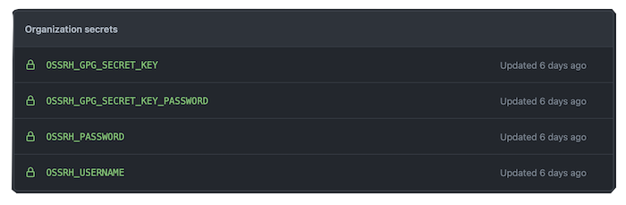

## KivaKit - Open Source Process &nbsp; 

### Overview &nbsp; 

KivaKit is open source software (OSS), and is distributed under [Apache License, Version 2.0](../../LICENSE). As an open source project, you are free to use KivaKit and contribute to it. This guide explains how KivaKit is organized and maintained as an OSS project.

Please keep the following in mind as you work on KivaKit or any open source project:

1. Nobody owes you anything. Most people who work on open source projects do so out of pure passion for software development and to solve a problem they think is worth solving. This might not include the particular issue you are focused on. Being well-informed, friendly and patient can help you to make your case. Be willing to help out if you can.

2. If you want a bug fix or improvement badly, consider doing it yourself. If the change might be significant, you may also want to contact project administrators, to ensure you're working on something that is desired by the community in a way that will be likely to be accepted.

3. Always show respect and give thanks for work that other people do. Take that attitude with you when evangelizing your favorite open source project.

### Setup &nbsp; 

This section describes the OSS setup requirements for users, developers and administrators.

#### Users

KivaKit artifacts are published to *Maven Central* and no special setup is required for KivaKit users to include artifacts in a project. However, SNAPSHOT builds can be accessed from the *Open Source Software Repository Hosting (OSSRH)* snapshot repository by adding this to your POM.xml file:

     <repository>
         <id>ossrh</id>
         <url>https://s01.oss.sonatype.org/content/repositories/snapshots</url>
         <releases>
             <enabled>false</enabled>
         </releases>
         <snapshots>
             <enabled>true</enabled>
         </snapshots>
     </repository>

#### Developers

Contributions of bug fixes and improvements from developers in the form of pull requests (PRs) don't require any special setup, other than the setup required to [*develop for KivaKit*](developer-setup.md).

#### Administrators

Project administrators require some additional setup to publish snapshots and releases:

1. Administrative access to the *GitHub* KivaKit repositories is required to commit changes, run build workflows and perform other necessary tasks.

2. A username and password to the
   *Sonatype [Open Source Software Repository Hosting](https://s01.oss.sonatype.org/)* (OSSRH)
   service, is required to inspect snapshots and builds that are staged for deployment to *Maven Central*.

### Publishing Requirements &nbsp; 

OSSRH and *Maven Central* have rigorous requirements for publishing artifacts. A new organization must claim a namespace (group id) on *Maven Central*, and artifacts that are published there must adhere to the requirements described below under in section entitled *Publishing a New Project*.

#### Setup for Telenav OSS Namespace

The following steps were executed to set up the *com.telenav* namespace (group id) to allow publishing of artifacts from *Telenav*. *These steps have already been performed and do not need to be followed again*, but they are noted here to serve as a reference in the future for how things were done and to guide any future projects that might not be published under the *Telenav*
namespace.

1. Create a [*Sonatype JIRA*](https://issues.sonatype.org/) account

2. Create a *New Project* ticket to register a namespace (aka "group id") for the project. See the [*OSSRH Guide*](https://central.sonatype.org/publish/publish-guide/) for details.

3. Respond to any requests from community volunteers, including domain ownership verification processes. For details on how this exchange might proceed take a look at the JIRA ticket [Request com.telenav namespace for Telenav, Inc.](https://issues.sonatype.org/browse/OSSRH-68055)
   that was used to set up the *Telenav* namespace.

   [...]

4. Once the first artifact is published according to the steps described in the following section, notify *Sonatype* OSSRH using the *JIRA New Project* ticket opened above, and they will turn on replication to *Maven Central*.

5. GPG signing keys must be created and used to sign builds. These keys should be kept safe and added to *GitHub* as organization-wide "secrets" for use in *GitHub* integration builds, along with an OSSRH username and password valid for publishing builds:

*Again, all of these steps have already been performed and should not be needed again.*

#### Publishing a Project

To publish artifacts to *Maven Central* in the *Telenav* namespace established above, the project build must conform to the specifications enforced by the *Sonatype Nexus* publishing tools:

1. Source archives must be attached using the *maven-source-plugin*
2. Javadoc archives must be attached using the *maven-javadoc-plugin*
3. Install GPG signing keys on your development machine
4. Add a profile step for signing artifacts with *the maven-gpg-plugin*w

Release and SNAPSHOT artifacts that have already been published, as well as release builds that are staged for publishing, can be found in the list of repositories under *Repositories* on the
*Sonatype OSSRH [Nexus Repository Manager](https://s01.oss.sonatype.org/)*

To test the readiness of a build before publishing it to the staging environment on OSSRH, execute the script:

    kivakit-build.sh deploy-local

This will build all the required artifacts and install them in the local *Maven* repository where they can be inspected. You should see source and *Javadoc* jars there as well as PGP signatures, ending in *.asc*, for each artifact.

Once the build is ready to be pushed to OSSRH, the *GitHub* continuous integration release workflow can be used (as described below), or the build can be deployed directly with:

    kivakit-build.sh deploy-ossrh

Direct deployment with this script will require GPG keys to be installed as in step 3 above. Contact project administration for access to these resources.

The scripts and build files in KivaKit and Lexakai are good references for how to release a project. In addition, the
[*OSSRH Guide*](https://central.sonatype.org/publish/publish-guide/) provides complete details for each step, as well as a series of videos that show just what to do (featuring *very loud* mandolin music, and thorough, patient narration in an excellent german accent).

Once a project is ready to publish, the *Sonatype Nexus Repository Manager* provides an easy way to do this:

1. Sign in to the *Sonatype OSSRH [Nexus Repository Manager](https://s01.oss.sonatype.org/)*

2. Locate the staged build (created above) by clicking the *Staging Repositories* link

3. Select the repository to publish and click the *Close* button (YES, this is counterintuitive!)

4. Check the activities tab for the selected repository, and if all went well, the *Release* button will be available and can be pushed to publish the build to *Maven Central*. If the release button remains disabled, the specific requirement that failed will be displayed in the list of verification activities, so it can be addressed before trying again.

The artifacts in a staged build (or any build) should look like this:

### GitHub Continuous Integration (CI) Builds

When code is checked into KivaKit,
[*GitHub actions*](https://github.com/Telenav/kivakit/actions) will automatically perform a build. If the check-in occurs to the *develop* branch or to a feature or bug-fix branch, a build will occur automatically, and the status of the build will appear on this page when it completes.

Successful builds on the *master* branch will be automatically pushed to an OSSRH staging repository accessible with the *[Sonatype OSSRH Repository Manager](https://s01.oss.sonatype.org/)*. The artifacts in this staging repository can then be pushed to *Maven Central* using the steps described above.

Builds of other branches will be automatically published to the snapshot repository at the same location. These are the *Maven* POM.xml tags that specify the location of the OSSRH snapshot and staging repositories.

    <distributionManagement>

        <snapshotRepository>
            <id>ossrh-snapshot</id>
            <url>https://s01.oss.sonatype.org/content/repositories/snapshots</url>
        </snapshotRepository>

        <repository>
            <id>ossrh-staging</id>
            <url>https://s01.oss.sonatype.org/service/local/staging/deploy/maven2/</url>
        </repository>

    </distributionManagement>

The scripts that perform these various functions are available in the *.github/workflows* folder in the root project of each repository:

| YAML Script     |     Purpose                   |
|--------------|-----------------------------------|
| build.yml | Performs an ordinary build |
| publish-snapshot.yml | Builds and publishes to OSSRH snapshot repository |
| publish-release | Builds and publishes to the OSSRH release staging repository |

