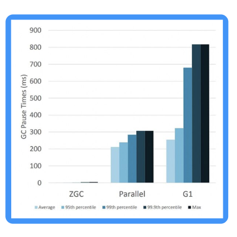

## KivaKit - Java Migration Notes &nbsp;  

### Welcome to Java 11+ &nbsp;&nbsp;    

Starting with Java 9, the JDK has supported _modules_.  
KivaKit has a modular design and runs on Java 11+.

### Why Upgrade from Java 8?

There are a number of good reasons to move on to more recent versions of Java:

* Modules
* Better security
* Faster startup
* HotSpot improvements
* Code sharing
* New and upcoming features such as:
    * Compact strings
    * Record types
    * Improved type inference
    * Switch expressions
    * Text blocks
    * Improved instanceof operator
    * Sealed classes
    * Value types
    * 64 bit addressable arrays
    * Cooperative multithreading

*But no reason is more significant or easier to understand than [Java's new super-fast garbage collectors](https://blogs.oracle.com/javamagazine/understanding-the-jdks-new-superfast-garbage-collectors)*.

The latency introduced by the pause time of the G1 collector (used in Java 8) can be more than 100x  
the GC pause time of the newest collector implementation, "ZGC". This alone is a very good reason   
for upgrading because we need to ensure that we can deliver servers with reasonable latency. We  
don't want customers waiting for GC pauses. A picture is worth a thousand words:

### Advantages of Modules   

Modules provide strong encapsulation, which has some advantages:

* Packages can be hidden from outside use
* Modules are more secure
* HotSpot can perform more aggressive optimizations on code that isn't public
* It's easier to use only part of the JDK or KivaKit without dragging in a lot of unneeded dependencies

### Strong Encapsulation   

Modular Java is more secure and performs better, but it places certain restrictions of Java 9+ code.

Under modular Java, reflection is **only permitted** if code declares itself to be an _open_ module.

Since KivaKit uses reflection, most modules in KivaKit are open modules. This allows reflective  
code like Kryo serialization to access private members and constructors. Even though this works,  
you will see this warning (which is by design from the developers of Java):

> WARNING: An illegal reflective access operation has occurred

This warning is annoying, but it cannot be turned off by design. Although future versions of Java  
will restrict reflection further, it is nothing to worry about under Java 12.

### Making Your Application Modular &nbsp; 

For users of KivaKit, it's only _required_ to declare your application to be an open module if you  
want KivaKit to be able to reflect on _your_ code. Even so, it can be useful to make your  
application modular, because you can specify exactly what parts of KivaKit you want to use.

To make your application modular, you need to put a module-info.java file in the root of your main  
source tree (in src/main/java). Your module declaration file might look like:

    open module navigation.myapplication 
    { 
        requires kivakit.core.utilities; 
        requires kivakit.core.resource; 
    }

This provides access to specific modules in KivaKit to your application and only those modules  
and their transitive dependencies. This can help control your dependency use.

  

