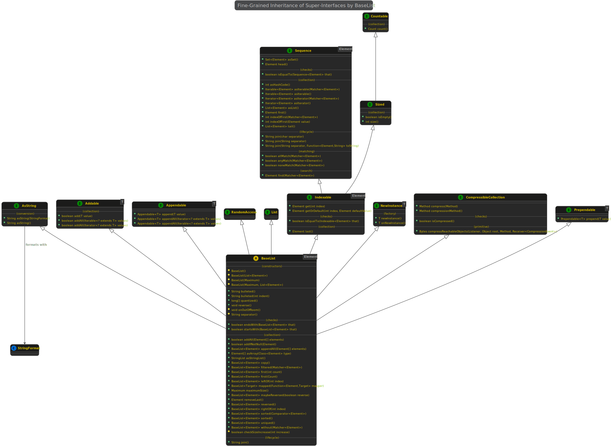

# kivakit-core-kernel - interfaces &nbsp; 

### Package &nbsp; 

*com.telenav.kivakit.core.kernel.interfaces*

### Index

[**Summary**](#summary)  
[**Advantages**](#advantages)  
[**Example**](#example)

### Summary 

KivaKit is an integrated set of frameworks. One of the major ways in which mini-frameworks inside KivaKit  
are connected together is by way of the set of broadly generic, *small* interfaces in *kivakit-core-kernel - interfaces*.  
For example, the *interfaces.collection* package contains these interfaces:

* Addable
* Appendable
* Contains
* Indexable
* Indexed
* Keyed
* Prependable
* Sequence

These interfaces can be used to compose object access so that an object can be used in many contexts.  
For example, the interfaces above can be used to break down a Java *List* into multiple small interfaces:

    public abstract class BaseList<Element> implements
        NewInstance<BaseList<Element>>,
        List<Element>,
        Indexable<Element>,
        Addable<Element>,
        Appendable<Element>,
        Prependable<Element>,
        CompressibleCollection,
        RandomAccess,
        AsString
    {
        [...]
    }

They also can be used to break down access to a *Set*:

    public abstract class BaseSet<Element> implements
        Set<Element>,
        NewInstance<BaseSet<Element>>,
        Sized,
        Addable<Element>,
        AsString
    {
        [...]
    }

or a *Route*, as below, which is *Indexable* but does not implement a Java collections interface.  
As a result, the *Route* class inherits considerable functionality from *Indexable* and its super-interfaces,  
and it can be used more generically:

    public abstract class Route implements 
        Iterable<Edge>, 
        Indexable<Edge>,
        Bounded, 
        AsString
    {
        [...]
    }

For example, it would be easy to write a class, *Adder* that added elements matching some criteria,   
or after some processing, to an *Addable*. Another example is that a statistical sampler could be  
written which takes an *Indexable&lt;Sample&gt;*, where *Sample* is an interface yielding a datum to be  
collected during random sampling of data. This method would then work with *BaseList* and *BaseSet*,  
but could also be made to work with *Route*.

### Advantages 

As we have seen, the fine-grained interface composition has some useful advantages:

#### Code that operates on fine-grained interfaces can be more generally applicable.

For example, *CountMap* associates a *Count* with a key. The method *CountMap.add(Key, Countable)* can  
add the *Count* provided by the *Countable* argument to the running count for the given key. This is a very  
simple example of how increased generality can decrease the code required to use an API. In this case,  
if you have an object that implements *Countable* you can add it directly to the *CountMap* with code  
like: *edgesPerTrip.add(trip, route)*. A more significant example of this methodology in action is the *Listener*  
interface, which is broadly implemented and accepted in many mini-frameworks in KivaKit, and is composed   
of several super-interfaces.

#### Interfaces and base classes inherit useful default methods from super-interfaces.

Interface composition *increases code re-use* and default methods are generic to any subclass implementing  
the interface abstract method(s) (normally only one or two methods or at most a few). This makes it easy  
to obtain a lot of functionality with less effort.

#### Interfaces and objects are easier to understand and maintain when they have fewer members

By composing objects from fine-grained interfaces, it is easy to recognize at a glance whole *groups* of methods  
that a given class provides. The semantics of these interfaces also define a contract that becomes familiar  
over time, making it easier to understand what an object does with less effort.

### Example 

The Indexable interface looks like this:

    public interface Indexable<Element> extends Sized, Sequence<Element>
    {
        Element get(int index)

        default Element getOrDefault(final int index, final Element defaultValue)
        default boolean isEqualTo(final Indexable<Element> that)
        default Element last()
    }

The base interfaces look like this:

    public interface Sized extends Countable
    {
        int size()

        default Count count()
        default boolean isEmpty()
    } 

    public interface Countable
    {
        Count count();
    }

    public interface Sequence<Element>
    {
        Iterator<Element> asIterator(final Matcher<Element> matcher)

        default boolean allMatch(final Matcher<Element> matcher)
        default boolean anyMatch(final Matcher<Element> matcher)
        default int asHashCode()
        default Iterable<Element> asIterable(final Matcher<Element> matcher)
        default Iterable<Element> asIterable()
        default Iterator<Element> asIterator()
        default List<Element> asList()
        default Set<Element> asSet()
        default Element find(final Matcher<Element> matcher)
        default Element first()
        default Element head()
        default int indexOfFirst(final Matcher<Element> matcher)
        default int indexOfFirst(final Element value)
        default boolean isEqualTo(final Sequence<Element> that)
        default String join(final char separator)
        default String join(final String separator)
        default String join(final String separator, final Function<Element, String> toString)
        default boolean noneMatch(final Matcher<Element> matcher)
        default List<Element> tail()
    }

A *BaseList* is *Indexable*, but so it a *Polyline*. Since *Indexable* extends *Sequence*, any Polyline or  
*BaseList* can be turned into a *List* with the default method *asList()* or joined into a string with *join(String)*.

The full inheritance hierarchy of *BaseList* contains a lot of functionality even though each individual  
interface only contains a few abstract methods:

 

